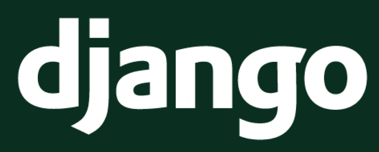

# Introducción

## ¿Que es Django?

**Django** es un **framework** de desarrollo web de alto nivel que incluye una serie de funcionalidades que facilitan la creación de sitios web **seguros** y **mantenibles**. Otra cosa que destaca de **Django** es su **versatilidad**, pudiendo crear con el sitios de todo tipo (CMS, wikis, portales de noticias) hasta **APIs Rest**.

* Una **API Rest** es una interfaz web que utiliza **HTTP** como protocolo de intercambio de objetos, comunmente utilizando el formato **json**, aunque no es obligatorio que así sea. Se sirve de **URIs** para indentificar recursos y de **métodos HTTP** para operar con ellos:
    * **GET** para pedir un recurso.
    * **POST** para crear recursos.
    * **PUT** para actualizar recursos.
    * **DELETE** para eliminar recursos.  

    Estos **métodos HTTP** pueden no actuar de la misma manera en todas las **APIs Rest**, por lo que no hay un estándar que especifique cuando usar uno u otro, pero es habitual ver esos métodos con esas acciones.

    También es importante reseñar que las **APIs Rest** se caraterizan por devolver diferentes **códigos de estado HTTP** (o **status code**) indicando con ello el tipo de respuesta acompañando la respuesta como tal.

    Esto se verá mas en profundidad en la parte de [Django Rest Framework](10%20-%20Django%20Rest%20Framework.md "Django Rest Framework").

Otra parte importante de la funcionalidad que provee **Django** por defecto es una potente **gestión de cuentas de usuario** y una **web de administración**.

## Origen del framework

El proyecto se empezó a desarrollar en torno a 2003 por un equipo de desarrolladores encargado del mantenimiento de periódicos digitales, pero no es hasta 2005 que se abre al público con su primera release.

Debe su nombre al guitarrista de jazz Django Reinhardt del que era fan 
Adrian Holovaty, uno de los miembros del equipo de desarrollo original.

Al igual que **Python** es desarrollado y mantenido por la [**Python Software Foundation**](https://www.python.org/psf/ "Python Software Foundation") , el desarrollo **Django** corre a cargo de la [**Django Software Foundation**](https://www.djangoproject.com/foundation/ "Django Software Foundation"), que también se encarga de mantenerlo y promover su uso.

## Estado actual

La última versión publicada de **Django** es la [versión 4.0](https://docs.djangoproject.com/en/4.0/releases/4.0/ "Django 4.0").

Entre sus principales novedades incluye el cambio de *pytz* por defecto a *zoneinfo* como librería de timezone (ya incluída en la librería estándar) y el soporte oficial de **Redis** como cache.

## Bibliografía

- [MDN Web Docs - Introducción a Django](https://developer.mozilla.org/es/docs/Learn/Server-side/Django/Introduction "MDN Web Docs - Introducción a Django")
- [Sitio Oficial de Django](https://www.djangoproject.com/ "Sitio Oficial de Django")