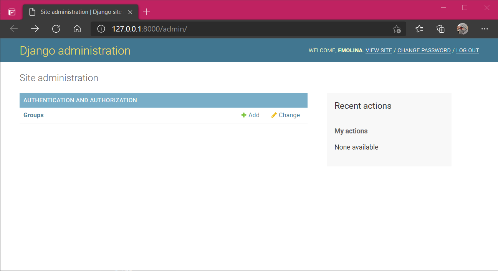
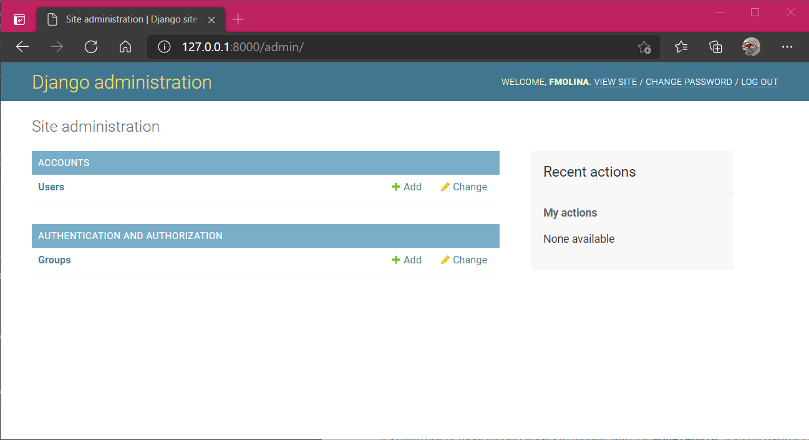

# La consola de Administración

## Introducción

De serie, **Django** añade un panel de administración personalizable para gestionar las **aplicaciones** y **modelos** del proyecto.


## Acceso

Si no se modifica, **Django** sirve el panel de administración en `/admin`. Si usamos el servidor de desarrollo en [`http://127.0.0.1:8000/admin`](http://127.0.0.1:8000/admin "Panel de administración").

Aparecerá una web de login. Para crear un usuario inicial se utiliza `python manage.py createsuperuser` y se rellenan los datos correspondientes al nuevo usuario administrador.

Al no haber habilitado explícitamente el administrador para las aplicaciones del modelo, estará prácticamente vacío:




## Añadiendo aplicaciones y modelos

Añadir **modelos** al administrador es muy sencillo. Se edita el fichero `admin.py` que ya tiene de antemano importado el **módulo** `admin` y se registra de la siguiente forma:

```python
from django.contrib import admin
from django.contrib.auth import get_user_model

User = get_user_model()


admin.site.register(User)
```

De esta forma, se habrá habilitado el **modelo** `User` de la **aplicación** `Accounts`:




## Mejoras

- Para facilitar la tarea al usuario que va a utilizar el formulario de creación, los campos del **modelo** admiten los **atributos** `verbose_name` para especificar el nombre que representará al campo en el formulario y `help_text` que añade una aclaración debajo del nombre del campo en el formulario
- Hemos visto la versión simple para agregar formularios al administrador de **Django** con `admin.site.register`, pero heredando de `admin.ModelAdmin` se pueden personalizar todavía más cosas como los campos que se representan en el listado, como se ordenan, etc. Leer [este artículo](https://docs.djangoproject.com/en/3.1/ref/contrib/admin/#modeladmin-options "ModelAdmin") de la documentación para más detalles

## Ejercicios

1. Añadir el administrador para todos los modelos actuales.
2. Úsalo para crear tres o cuatro `noticias`, las necesitaremos en la siguiente sección.
