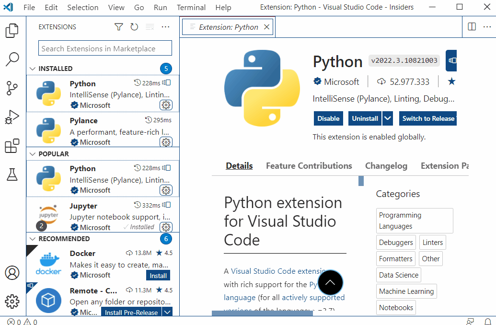
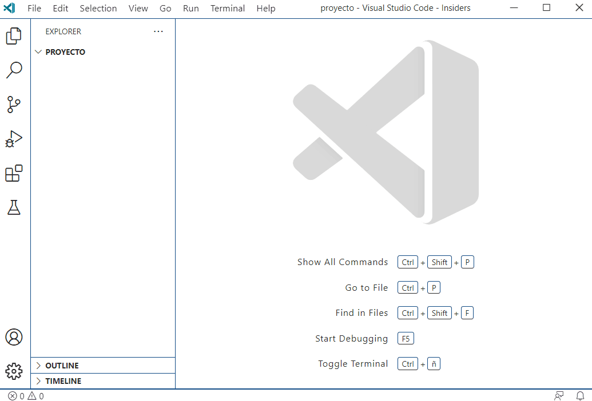
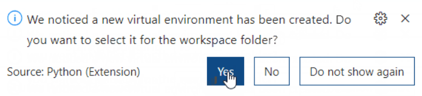
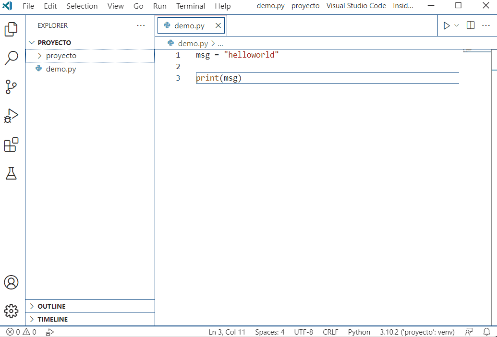
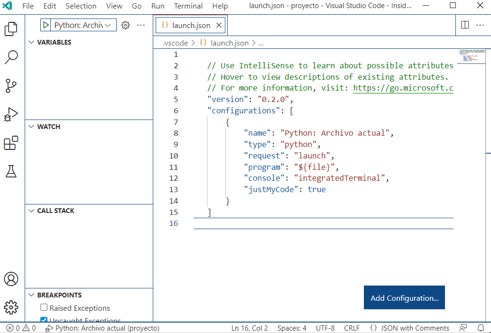

# Instalación de Visual Studio Code

## Introducción
Un buen editor de código para trabajar con **python** es **Visual Studio Code**. Dispone de diversas herramientas que hacen la vida más fácil y funciona además con todo tipo de lenguajes de programación.

## Instala la extensión de Python
Lo ideal es instalar la extensión de **Python** que está disponible en la sección *Extensiones*:

Una vez instalada, reinicia la aplicación (puedes cerrarla y volverla a abrir).

## Para arrancar un proyecto
La manera más sencilla para arrancar un proyecto es seleccionar una carpeta en **Visual Studio Code**:

Después, arranca un terminal. Puedes hacerlo en *Terminal - New Terminal*.

Ahí, crea un entorno virtual y actívalo:

- ¡Nota! Si estás en **Windows** y tu consola es **Powershell**, hay que activar la ejecución de scripts. Ejecuta:

        Set-ExecutionPolicy -ExecutionPolicy Unrestricted -Scope CurrentUser

   Así se habilita la ejecución de scripts para el usuario actual.

Es posible que nada más crearla, **Visual Studio Code** te muestre un pop-up preguntándote si quieres seleccionar el nuevo intérprete como el intérprete para el proyecto:

Si no te pregunta, se puede seleccionar el intérprete con la **paleta de comandos**:

Date cuenta de que una vez hecho, el entorno virtual se activa automáticamente cuando se abre un terminal.

## Configurando un depurador
Una vez existe un intérprete seleccionado para el proyecto, se puede configurar un depurador o debugger.

Para crear un depurador sencillo para depurar el archivo actual (útil para scripts), se puede hacer lo siguiente:

Como se ve en la imagen, se puede poner un punto de interrupción, arrancarlo y lo tienes, la ejecución se parará en ese punto y podremos ver el estado de las variables en ese momento.

También se puede configurar para **Django**:

## Conclusión

Y ya está. Existen más configuraciones diferentes para **Python** con **Visual Studio Code**, pero para un uso habitual, es más que suficiente.
